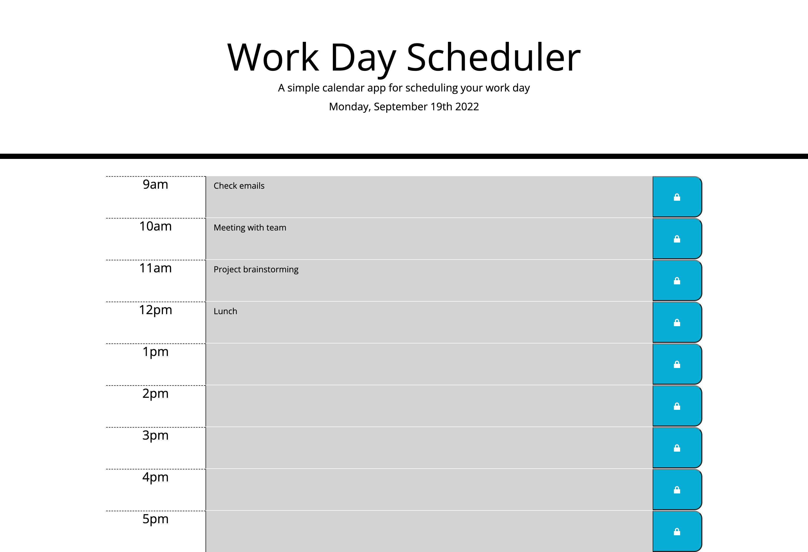

# Work-Day-Scheduler

## Description

A simple user friendly calendar application can be extremely useful for planning out your work day. This Work Day Scheduler is a lightweight application that runs in the brower with dynamically updated HTML and CSS powered by jQuery. Taking a few minutes at the start of your day for planning and organizing tasks can make every bit of difference with your overall production. This calendar application also conveniently displays the current day in the header while keeping track of past, present and future events through color coding.

## Usage

1. Load the Work Day Scheduler in your browser and bookmark for quick access.
2. Add your work day events to any hourly block from the 9am to 5pm business hours.
3. Click the lock icon next to each event to save your tasks!

## Mock-up

The following images show the web application's appearance and functionality:

[Deployed Application](https://djbalabis.github.io/Work-Day-Scheduler/)